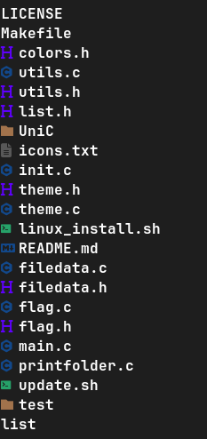

# List


A better version of 'ls'

- better tree representation

- icons

Version 2

### Screenshots




### Requirements

- Nerdfont https://www.nerdfonts.com/font-downloads

### TODO

- themes (only default is available now)

### Minor bugs

- size align breaks with large names

### Install

#### Linux

```sh
cd <this folder>
sh ./install.sh
```

### Usage
``` bash
list <path> <flags separated by space>
```

#### Flags

- ```-R``` recursive 
- ```-d``` displays file size
- ```-a``` hidden files
- ```-V``` version

### ls vs list

- list takes about 2x ram
- speed is really close to ls, difference could be measured in ms or less
