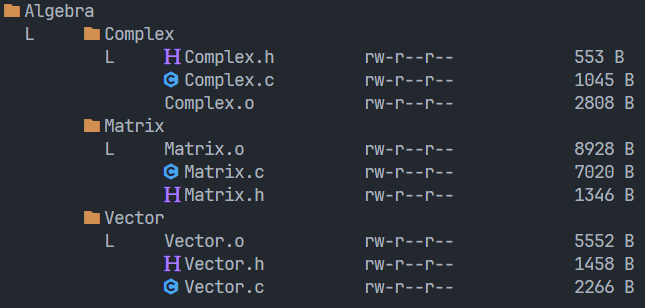

# List


A better version of 'ls'

- tree representation

- icons



Version 2

### Requirements

- Nerdfont https://www.nerdfonts.com/font-downloads

### TODO

- themes

### Linux

#### Install

```sh
cd <this folder>
sh ./linux_install.sh
```

#### Update

```sh
sh ./linux_update.sh
```

### Usage
``` bash
list <'path'> <'-flags'>
```

#### Flags

- ```R``` recursive
- ```d``` file size
- ```a``` hidden files
- ```V``` version
- ```l``` permissions
- ```h``` help

### ls vs list

#### RAM
- about 3/2 of ls ram
- tested with valgrind
  
#### Speed
- really close to ls
- not tested
